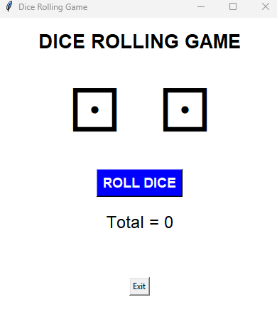
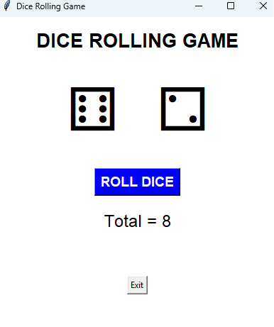
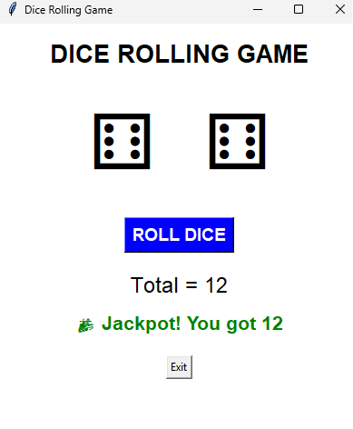
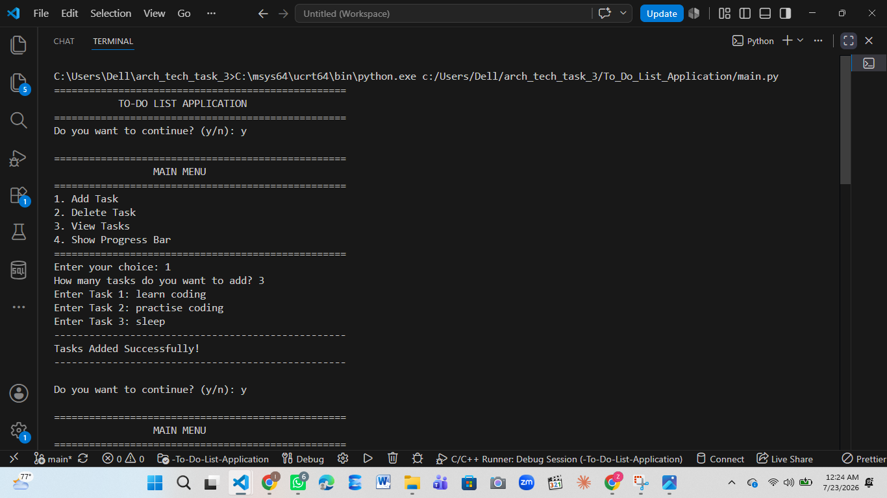
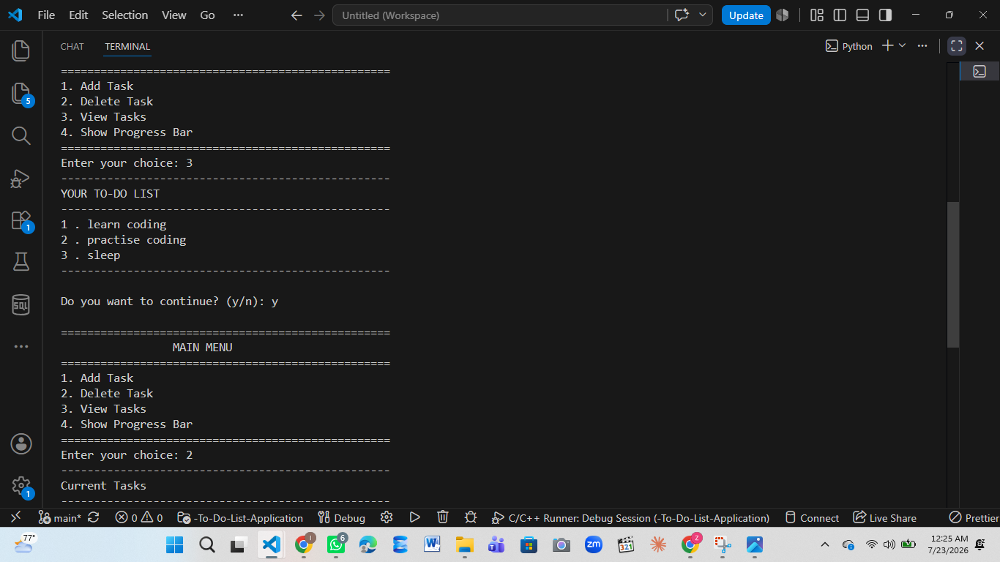
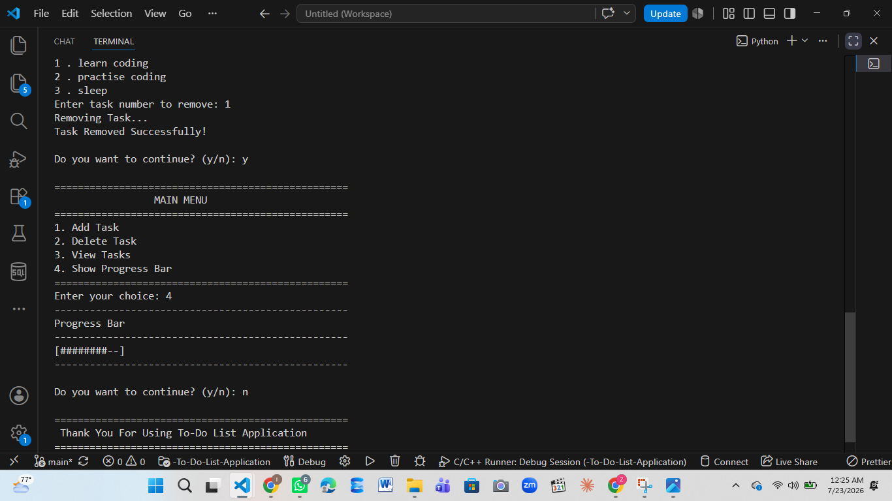
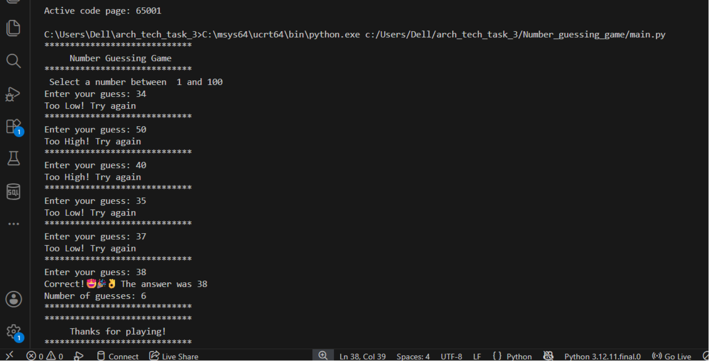
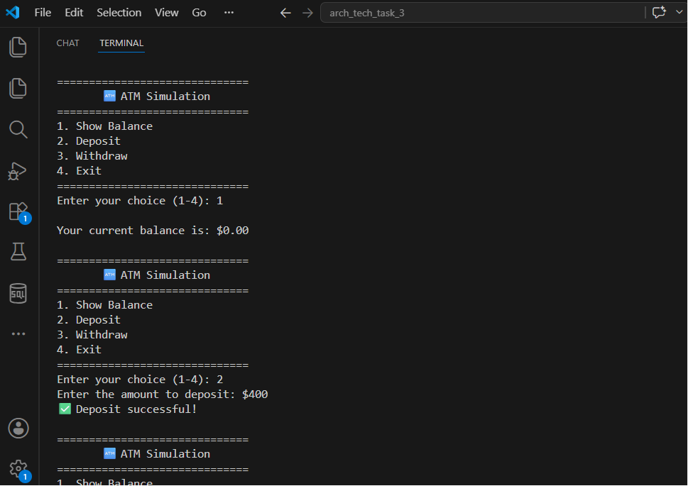
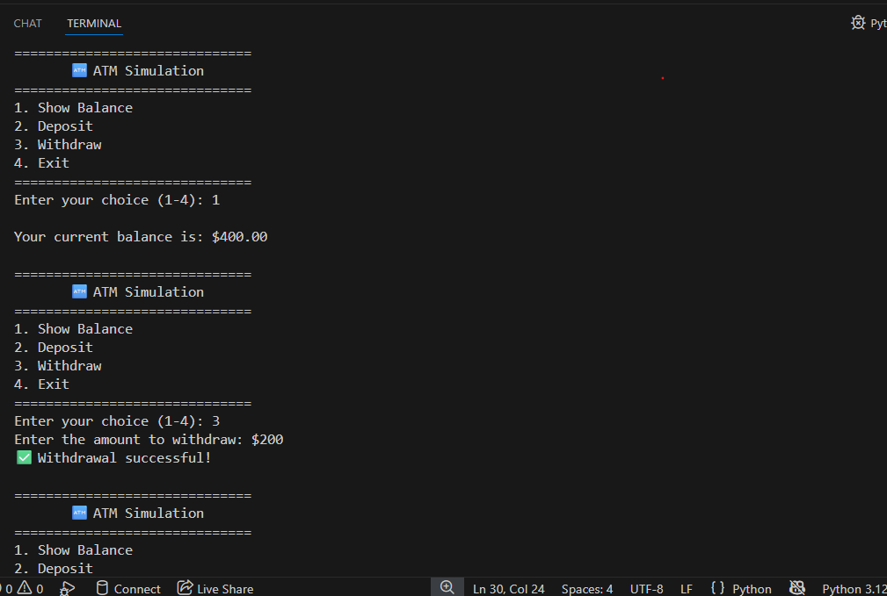
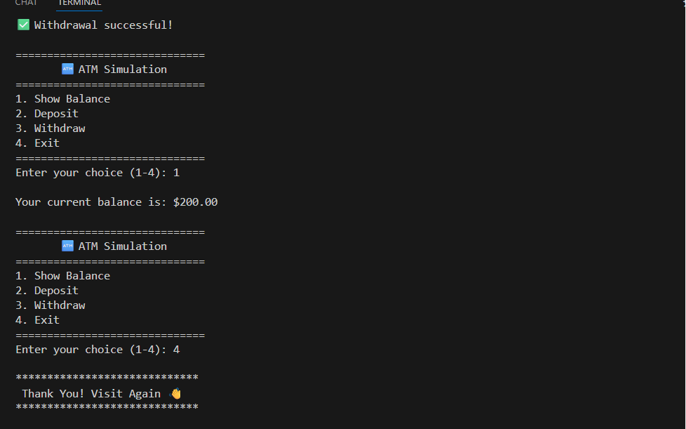

# Arch_Technologies_Internship_2026

This repository contains beginner-friendly Python projects developed to improve my programming, problem-solving, GUI development, and Object-Oriented Programming (OOP) skills.

---

## 📂 Projects Included

### 🎲 1. Dice Rolling Game (Tkinter)

A GUI-based dice rolling game built using Python Tkinter. Two dice are rolled randomly, and the total score is displayed. A special jackpot message appears when the total is 12.

**Features**

- GUI using Tkinter
- Random dice generation
- Unicode dice faces
- Total score calculation
- Jackpot message
- Exit button

**Technologies**

- Python
- Tkinter
- Random Module

### 🖼️ Output

  

  

  

---

### 📋 2. To-Do List Application

A console-based application that helps users manage their daily tasks.

**Features**

- Add tasks
- Delete tasks
- View tasks
- Progress bar
- Menu-driven interface

**Technologies**

- Python
- Time Module

### 🖼️ Output

  

  

  

---

### 🎮 3. Number Guessing Game

A fun console-based game where users guess a randomly generated number.

**Features**

- Random number generation
- User input validation
- High/Low hints
- Guess counter

**Technologies**

- Python
- Random Module

### 🖼️ Output

  

---

### 🏧 4. ATM Simulation (OOP)

A simple ATM system developed using Object-Oriented Programming.

**Features**

- Show balance
- Deposit money
- Withdraw money
- Input validation
- Menu-driven interface

**Technologies**

- Python
- OOP (Classes & Objects)

### 🖼️ Output

  

  

  

---

## 📚 Skills Learned

- Python Fundamentals
- Functions
- Loops
- Conditional Statements
- Lists
- User Input Validation
- Random Module
- Time Module
- Tkinter GUI
- Object-Oriented Programming (OOP)

---

## 🙌 Acknowledgement

These projects were developed as part of my Python learning journey and internship to strengthen my programming and problem-solving skills.

⭐ Thank you for visiting this repository!
